Barcode Examples
================
Auto generated examples. See `make_examples.py` for details.

## CODE11

Example `CODE11` barcode with content `1234567`

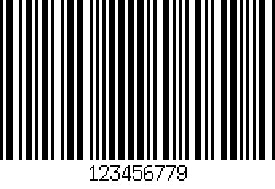

Code example:
```python
import pyzint

symbol = pyzint.Zint(
    '1234567', pyzint.BARCODE_CODE11
)

with open('CODE11.bmp', "wb") as bmp:
    bmp.write(symbol.render_bmp())
```
## C25MATRIX

Example `C25MATRIX` barcode with content `1234567`

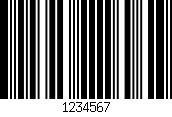

Code example:
```python
import pyzint

symbol = pyzint.Zint(
    '1234567', pyzint.BARCODE_C25MATRIX
)

with open('C25MATRIX.bmp', "wb") as bmp:
    bmp.write(symbol.render_bmp())
```
## C25INTER

Example `C25INTER` barcode with content `1234567`

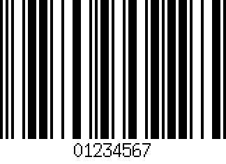

Code example:
```python
import pyzint

symbol = pyzint.Zint(
    '1234567', pyzint.BARCODE_C25INTER
)

with open('C25INTER.bmp', "wb") as bmp:
    bmp.write(symbol.render_bmp())
```
## C25IATA

Example `C25IATA` barcode with content `1234567`

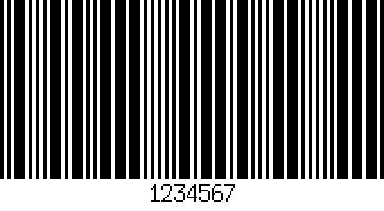

Code example:
```python
import pyzint

symbol = pyzint.Zint(
    '1234567', pyzint.BARCODE_C25IATA
)

with open('C25IATA.bmp', "wb") as bmp:
    bmp.write(symbol.render_bmp())
```
## C25LOGIC

Example `C25LOGIC` barcode with content `1234567`

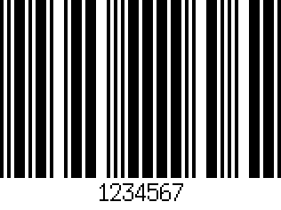

Code example:
```python
import pyzint

symbol = pyzint.Zint(
    '1234567', pyzint.BARCODE_C25LOGIC
)

with open('C25LOGIC.bmp', "wb") as bmp:
    bmp.write(symbol.render_bmp())
```
## C25IND

Example `C25IND` barcode with content `1234567`

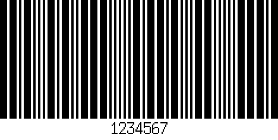

Code example:
```python
import pyzint

symbol = pyzint.Zint(
    '1234567', pyzint.BARCODE_C25IND
)

with open('C25IND.bmp', "wb") as bmp:
    bmp.write(symbol.render_bmp())
```
## CODE39

Example `CODE39` barcode with content `1234567`

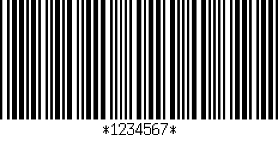

Code example:
```python
import pyzint

symbol = pyzint.Zint(
    '1234567', pyzint.BARCODE_CODE39
)

with open('CODE39.bmp', "wb") as bmp:
    bmp.write(symbol.render_bmp())
```
## EXCODE39

Example `EXCODE39` barcode with content `1234567`

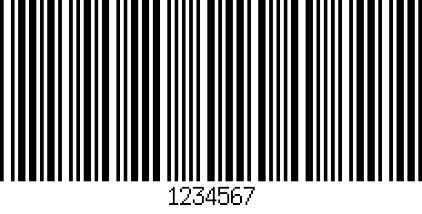

Code example:
```python
import pyzint

symbol = pyzint.Zint(
    '1234567', pyzint.BARCODE_EXCODE39
)

with open('EXCODE39.bmp', "wb") as bmp:
    bmp.write(symbol.render_bmp())
```
## EANX

Example `EANX` barcode with content `1234567`

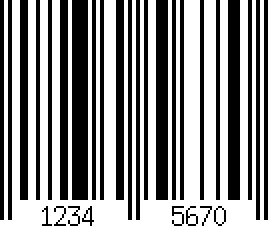

Code example:
```python
import pyzint

symbol = pyzint.Zint(
    '1234567', pyzint.BARCODE_EANX
)

with open('EANX.bmp', "wb") as bmp:
    bmp.write(symbol.render_bmp())
```
## EANX_CHK

Example `EANX_CHK` barcode with content `123456789012`

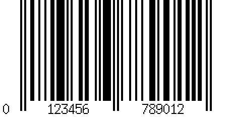

Code example:
```python
import pyzint

symbol = pyzint.Zint(
    '123456789012', pyzint.BARCODE_EANX_CHK
)

with open('EANX_CHK.bmp', "wb") as bmp:
    bmp.write(symbol.render_bmp())
```
## EAN128

Example `EAN128` barcode with content `[01]12345678901234`

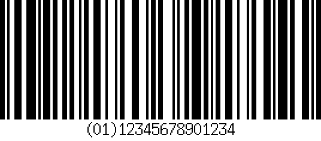

Code example:
```python
import pyzint

symbol = pyzint.Zint(
    '[01]12345678901234', pyzint.BARCODE_EAN128
)

with open('EAN128.bmp', "wb") as bmp:
    bmp.write(symbol.render_bmp())
```
## CODABAR

Example `CODABAR` barcode with content `A40156B`

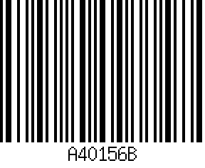

Code example:
```python
import pyzint

symbol = pyzint.Zint(
    'A40156B', pyzint.BARCODE_CODABAR
)

with open('CODABAR.bmp', "wb") as bmp:
    bmp.write(symbol.render_bmp())
```
## CODE128

Example `CODE128` barcode with content `1234567`

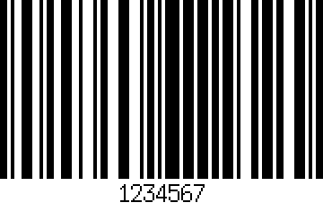

Code example:
```python
import pyzint

symbol = pyzint.Zint(
    '1234567', pyzint.BARCODE_CODE128
)

with open('CODE128.bmp', "wb") as bmp:
    bmp.write(symbol.render_bmp())
```
## DPLEIT

Example `DPLEIT` barcode with content `1234567`


Code example:
```python
import pyzint

symbol = pyzint.Zint(
    '1234567', pyzint.BARCODE_DPLEIT
)

with open('DPLEIT.bmp', "wb") as bmp:
    bmp.write(symbol.render_bmp())
```
## DPIDENT

Example `DPIDENT` barcode with content `1234567`

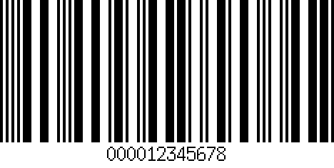

Code example:
```python
import pyzint

symbol = pyzint.Zint(
    '1234567', pyzint.BARCODE_DPIDENT
)

with open('DPIDENT.bmp', "wb") as bmp:
    bmp.write(symbol.render_bmp())
```
## CODE16K

Example `CODE16K` barcode with content `1234567`


Code example:
```python
import pyzint

symbol = pyzint.Zint(
    '1234567', pyzint.BARCODE_CODE16K
)

with open('CODE16K.bmp', "wb") as bmp:
    bmp.write(symbol.render_bmp())
```
## CODE49

Example `CODE49` barcode with content `1234567`


Code example:
```python
import pyzint

symbol = pyzint.Zint(
    '1234567', pyzint.BARCODE_CODE49
)

with open('CODE49.bmp', "wb") as bmp:
    bmp.write(symbol.render_bmp())
```
## CODE93

Example `CODE93` barcode with content `1234567`

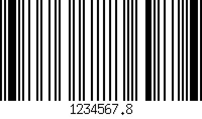

Code example:
```python
import pyzint

symbol = pyzint.Zint(
    '1234567', pyzint.BARCODE_CODE93
)

with open('CODE93.bmp', "wb") as bmp:
    bmp.write(symbol.render_bmp())
```
## FLAT

Example `FLAT` barcode with content `1234567`


Code example:
```python
import pyzint

symbol = pyzint.Zint(
    '1234567', pyzint.BARCODE_FLAT
)

with open('FLAT.bmp', "wb") as bmp:
    bmp.write(symbol.render_bmp())
```
## RSS14

Example `RSS14` barcode with content `1234567`

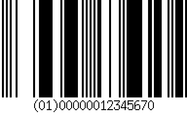

Code example:
```python
import pyzint

symbol = pyzint.Zint(
    '1234567', pyzint.BARCODE_RSS14
)

with open('RSS14.bmp', "wb") as bmp:
    bmp.write(symbol.render_bmp())
```
## RSS_LTD

Example `RSS_LTD` barcode with content `1234567`

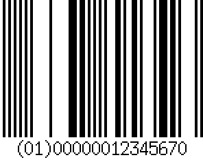

Code example:
```python
import pyzint

symbol = pyzint.Zint(
    '1234567', pyzint.BARCODE_RSS_LTD
)

with open('RSS_LTD.bmp', "wb") as bmp:
    bmp.write(symbol.render_bmp())
```
## RSS_EXP

Example `RSS_EXP` barcode with content `[01]12345678901234`

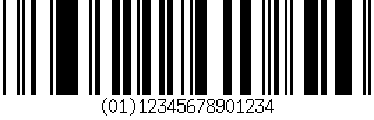

Code example:
```python
import pyzint

symbol = pyzint.Zint(
    '[01]12345678901234', pyzint.BARCODE_RSS_EXP
)

with open('RSS_EXP.bmp', "wb") as bmp:
    bmp.write(symbol.render_bmp())
```
## TELEPEN

Example `TELEPEN` barcode with content `1234567`


Code example:
```python
import pyzint

symbol = pyzint.Zint(
    '1234567', pyzint.BARCODE_TELEPEN
)

with open('TELEPEN.bmp', "wb") as bmp:
    bmp.write(symbol.render_bmp())
```
## UPCA

Example `UPCA` barcode with content `1234567`

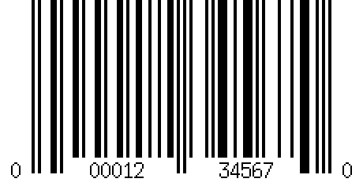

Code example:
```python
import pyzint

symbol = pyzint.Zint(
    '1234567', pyzint.BARCODE_UPCA
)

with open('UPCA.bmp', "wb") as bmp:
    bmp.write(symbol.render_bmp())
```
## UPCA_CHK

Example `UPCA_CHK` barcode with content `123456789012`

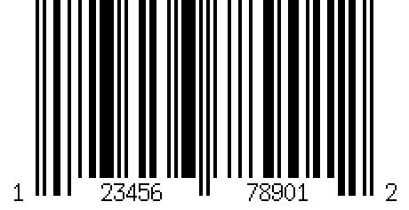

Code example:
```python
import pyzint

symbol = pyzint.Zint(
    '123456789012', pyzint.BARCODE_UPCA_CHK
)

with open('UPCA_CHK.bmp', "wb") as bmp:
    bmp.write(symbol.render_bmp())
```
## UPCE

Example `UPCE` barcode with content `001238`

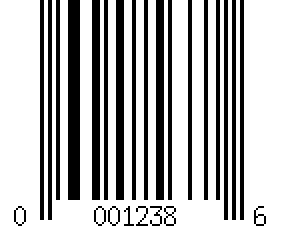

Code example:
```python
import pyzint

symbol = pyzint.Zint(
    '001238', pyzint.BARCODE_UPCE
)

with open('UPCE.bmp', "wb") as bmp:
    bmp.write(symbol.render_bmp())
```
## UPCE_CHK

Example `UPCE_CHK` barcode with content `04252614`

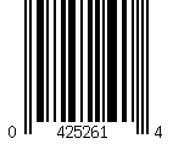

Code example:
```python
import pyzint

symbol = pyzint.Zint(
    '04252614', pyzint.BARCODE_UPCE_CHK
)

with open('UPCE_CHK.bmp', "wb") as bmp:
    bmp.write(symbol.render_bmp())
```
## POSTNET

Example `POSTNET` barcode with content `555551237`


Code example:
```python
import pyzint

symbol = pyzint.Zint(
    '555551237', pyzint.BARCODE_POSTNET
)

with open('POSTNET.bmp', "wb") as bmp:
    bmp.write(symbol.render_bmp())
```
## MSI_PLESSEY

Example `MSI_PLESSEY` barcode with content `1234567`

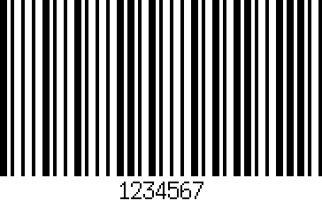

Code example:
```python
import pyzint

symbol = pyzint.Zint(
    '1234567', pyzint.BARCODE_MSI_PLESSEY
)

with open('MSI_PLESSEY.bmp', "wb") as bmp:
    bmp.write(symbol.render_bmp())
```
## FIM

Example `FIM` barcode with content `A`


Code example:
```python
import pyzint

symbol = pyzint.Zint(
    'A', pyzint.BARCODE_FIM
)

with open('FIM.bmp', "wb") as bmp:
    bmp.write(symbol.render_bmp())
```
## LOGMARS

Example `LOGMARS` barcode with content `1234567`


Code example:
```python
import pyzint

symbol = pyzint.Zint(
    '1234567', pyzint.BARCODE_LOGMARS
)

with open('LOGMARS.bmp', "wb") as bmp:
    bmp.write(symbol.render_bmp())
```
## PHARMA

Example `PHARMA` barcode with content `12345`


Code example:
```python
import pyzint

symbol = pyzint.Zint(
    '12345', pyzint.BARCODE_PHARMA
)

with open('PHARMA.bmp', "wb") as bmp:
    bmp.write(symbol.render_bmp())
```
## PZN

Example `PZN` barcode with content `1234567`

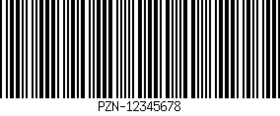

Code example:
```python
import pyzint

symbol = pyzint.Zint(
    '1234567', pyzint.BARCODE_PZN
)

with open('PZN.bmp', "wb") as bmp:
    bmp.write(symbol.render_bmp())
```
## PHARMA_TWO

Example `PHARMA_TWO` barcode with content `1234567`


Code example:
```python
import pyzint

symbol = pyzint.Zint(
    '1234567', pyzint.BARCODE_PHARMA_TWO
)

with open('PHARMA_TWO.bmp', "wb") as bmp:
    bmp.write(symbol.render_bmp())
```
## PDF417

Example `PDF417` barcode with content `Hello World`


Code example:
```python
import pyzint

symbol = pyzint.Zint(
    'Hello World', pyzint.BARCODE_PDF417
)

with open('PDF417.bmp', "wb") as bmp:
    bmp.write(symbol.render_bmp())
```
## PDF417TRUNC

Example `PDF417TRUNC` barcode with content `1234567`


Code example:
```python
import pyzint

symbol = pyzint.Zint(
    '1234567', pyzint.BARCODE_PDF417TRUNC
)

with open('PDF417TRUNC.bmp', "wb") as bmp:
    bmp.write(symbol.render_bmp())
```
## MAXICODE

Example `MAXICODE` barcode with content `1234567`

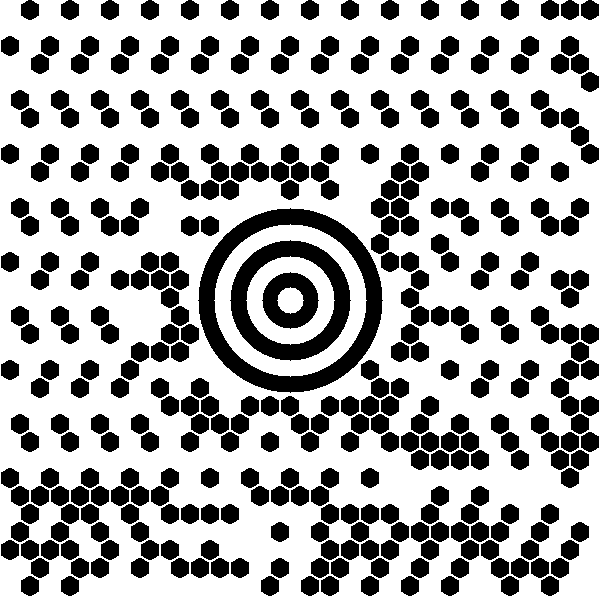

Code example:
```python
import pyzint

symbol = pyzint.Zint(
    '1234567', pyzint.BARCODE_MAXICODE
)

with open('MAXICODE.bmp', "wb") as bmp:
    bmp.write(symbol.render_bmp())
```
## QRCODE

Example `QRCODE` barcode with content `1234567`


Code example:
```python
import pyzint

symbol = pyzint.Zint(
    '1234567', pyzint.BARCODE_QRCODE
)

with open('QRCODE.bmp', "wb") as bmp:
    bmp.write(symbol.render_bmp())
```
## CODE128B

Example `CODE128B` barcode with content `1234567`


Code example:
```python
import pyzint

symbol = pyzint.Zint(
    '1234567', pyzint.BARCODE_CODE128B
)

with open('CODE128B.bmp', "wb") as bmp:
    bmp.write(symbol.render_bmp())
```
## AUSPOST

Example `AUSPOST` barcode with content `12345678`


Code example:
```python
import pyzint

symbol = pyzint.Zint(
    '12345678', pyzint.BARCODE_AUSPOST
)

with open('AUSPOST.bmp', "wb") as bmp:
    bmp.write(symbol.render_bmp())
```
## AUSREPLY

Example `AUSREPLY` barcode with content `1234567`


Code example:
```python
import pyzint

symbol = pyzint.Zint(
    '1234567', pyzint.BARCODE_AUSREPLY
)

with open('AUSREPLY.bmp', "wb") as bmp:
    bmp.write(symbol.render_bmp())
```
## AUSROUTE

Example `AUSROUTE` barcode with content `1234567`


Code example:
```python
import pyzint

symbol = pyzint.Zint(
    '1234567', pyzint.BARCODE_AUSROUTE
)

with open('AUSROUTE.bmp', "wb") as bmp:
    bmp.write(symbol.render_bmp())
```
## AUSREDIRECT

Example `AUSREDIRECT` barcode with content `1234567`


Code example:
```python
import pyzint

symbol = pyzint.Zint(
    '1234567', pyzint.BARCODE_AUSREDIRECT
)

with open('AUSREDIRECT.bmp', "wb") as bmp:
    bmp.write(symbol.render_bmp())
```
## ISBNX

Example `ISBNX` barcode with content `9781491946008`

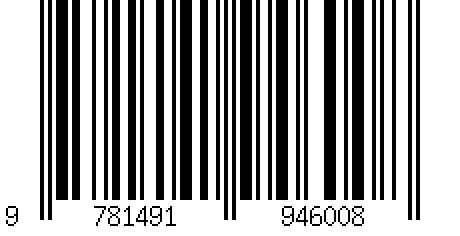

Code example:
```python
import pyzint

symbol = pyzint.Zint(
    '9781491946008', pyzint.BARCODE_ISBNX
)

with open('ISBNX.bmp', "wb") as bmp:
    bmp.write(symbol.render_bmp())
```
## RM4SCC

Example `RM4SCC` barcode with content `1234567`


Code example:
```python
import pyzint

symbol = pyzint.Zint(
    '1234567', pyzint.BARCODE_RM4SCC
)

with open('RM4SCC.bmp', "wb") as bmp:
    bmp.write(symbol.render_bmp())
```
## DATAMATRIX

Example `DATAMATRIX` barcode with content `1234567`


Code example:
```python
import pyzint

symbol = pyzint.Zint(
    '1234567', pyzint.BARCODE_DATAMATRIX
)

with open('DATAMATRIX.bmp', "wb") as bmp:
    bmp.write(symbol.render_bmp())
```
## EAN14

Example `EAN14` barcode with content `1234567`

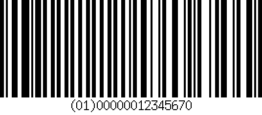

Code example:
```python
import pyzint

symbol = pyzint.Zint(
    '1234567', pyzint.BARCODE_EAN14
)

with open('EAN14.bmp', "wb") as bmp:
    bmp.write(symbol.render_bmp())
```
## VIN

Example `VIN` barcode with content `123456789012`


Code example:
```python
import pyzint

symbol = pyzint.Zint(
    '123456789012', pyzint.BARCODE_VIN
)

with open('VIN.bmp', "wb") as bmp:
    bmp.write(symbol.render_bmp())
```
## CODABLOCKF

Example `CODABLOCKF` barcode with content `1234567`


Code example:
```python
import pyzint

symbol = pyzint.Zint(
    '1234567', pyzint.BARCODE_CODABLOCKF
)

with open('CODABLOCKF.bmp', "wb") as bmp:
    bmp.write(symbol.render_bmp())
```
## NVE18

Example `NVE18` barcode with content `1234567`

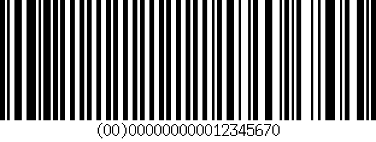

Code example:
```python
import pyzint

symbol = pyzint.Zint(
    '1234567', pyzint.BARCODE_NVE18
)

with open('NVE18.bmp', "wb") as bmp:
    bmp.write(symbol.render_bmp())
```
## JAPANPOST

Example `JAPANPOST` barcode with content `1234567`


Code example:
```python
import pyzint

symbol = pyzint.Zint(
    '1234567', pyzint.BARCODE_JAPANPOST
)

with open('JAPANPOST.bmp', "wb") as bmp:
    bmp.write(symbol.render_bmp())
```
## KOREAPOST

Example `KOREAPOST` barcode with content `123456`


Code example:
```python
import pyzint

symbol = pyzint.Zint(
    '123456', pyzint.BARCODE_KOREAPOST
)

with open('KOREAPOST.bmp', "wb") as bmp:
    bmp.write(symbol.render_bmp())
```
## RSS14STACK

Example `RSS14STACK` barcode with content `1234567`


Code example:
```python
import pyzint

symbol = pyzint.Zint(
    '1234567', pyzint.BARCODE_RSS14STACK
)

with open('RSS14STACK.bmp', "wb") as bmp:
    bmp.write(symbol.render_bmp())
```
## RSS14STACK_OMNI

Example `RSS14STACK_OMNI` barcode with content `1234567`


Code example:
```python
import pyzint

symbol = pyzint.Zint(
    '1234567', pyzint.BARCODE_RSS14STACK_OMNI
)

with open('RSS14STACK_OMNI.bmp', "wb") as bmp:
    bmp.write(symbol.render_bmp())
```
## RSS_EXPSTACK

Example `RSS_EXPSTACK` barcode with content `[01]12345678901234`

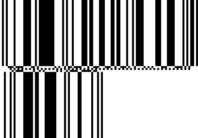

Code example:
```python
import pyzint

symbol = pyzint.Zint(
    '[01]12345678901234', pyzint.BARCODE_RSS_EXPSTACK
)

with open('RSS_EXPSTACK.bmp', "wb") as bmp:
    bmp.write(symbol.render_bmp())
```
## PLANET

Example `PLANET` barcode with content `1234567890123`


Code example:
```python
import pyzint

symbol = pyzint.Zint(
    '1234567890123', pyzint.BARCODE_PLANET
)

with open('PLANET.bmp', "wb") as bmp:
    bmp.write(symbol.render_bmp())
```
## MICROPDF417

Example `MICROPDF417` barcode with content `1234567`


Code example:
```python
import pyzint

symbol = pyzint.Zint(
    '1234567', pyzint.BARCODE_MICROPDF417
)

with open('MICROPDF417.bmp', "wb") as bmp:
    bmp.write(symbol.render_bmp())
```
## ONECODE

Example `ONECODE` barcode with content `12345678901234567890`


Code example:
```python
import pyzint

symbol = pyzint.Zint(
    '12345678901234567890', pyzint.BARCODE_ONECODE
)

with open('ONECODE.bmp', "wb") as bmp:
    bmp.write(symbol.render_bmp())
```
## PLESSEY

Example `PLESSEY` barcode with content `1234567`


Code example:
```python
import pyzint

symbol = pyzint.Zint(
    '1234567', pyzint.BARCODE_PLESSEY
)

with open('PLESSEY.bmp', "wb") as bmp:
    bmp.write(symbol.render_bmp())
```
## TELEPEN_NUM

Example `TELEPEN_NUM` barcode with content `12345678`

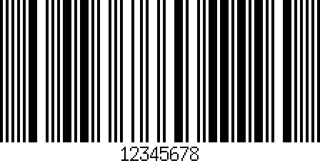

Code example:
```python
import pyzint

symbol = pyzint.Zint(
    '12345678', pyzint.BARCODE_TELEPEN_NUM
)

with open('TELEPEN_NUM.bmp', "wb") as bmp:
    bmp.write(symbol.render_bmp())
```
## ITF14

Example `ITF14` barcode with content `12345678`

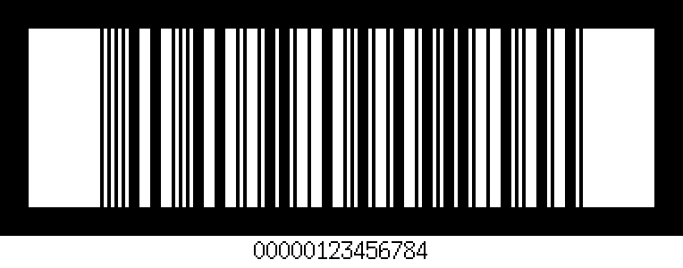

Code example:
```python
import pyzint

symbol = pyzint.Zint(
    '12345678', pyzint.BARCODE_ITF14
)

with open('ITF14.bmp', "wb") as bmp:
    bmp.write(symbol.render_bmp())
```
## KIX

Example `KIX` barcode with content `12345678`


Code example:
```python
import pyzint

symbol = pyzint.Zint(
    '12345678', pyzint.BARCODE_KIX
)

with open('KIX.bmp', "wb") as bmp:
    bmp.write(symbol.render_bmp())
```
## AZTEC

Example `AZTEC` barcode with content `12345678`


Code example:
```python
import pyzint

symbol = pyzint.Zint(
    '12345678', pyzint.BARCODE_AZTEC
)

with open('AZTEC.bmp', "wb") as bmp:
    bmp.write(symbol.render_bmp())
```
## DAFT

Example `DAFT` barcode with content `A`


Code example:
```python
import pyzint

symbol = pyzint.Zint(
    'A', pyzint.BARCODE_DAFT
)

with open('DAFT.bmp', "wb") as bmp:
    bmp.write(symbol.render_bmp())
```
## MICROQR

Example `MICROQR` barcode with content `12345678`


Code example:
```python
import pyzint

symbol = pyzint.Zint(
    '12345678', pyzint.BARCODE_MICROQR
)

with open('MICROQR.bmp', "wb") as bmp:
    bmp.write(symbol.render_bmp())
```
## HIBC_128

Example `HIBC_128` barcode with content `123456789`

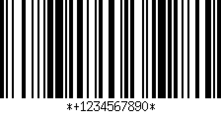

Code example:
```python
import pyzint

symbol = pyzint.Zint(
    '123456789', pyzint.BARCODE_HIBC_128
)

with open('HIBC_128.bmp', "wb") as bmp:
    bmp.write(symbol.render_bmp())
```
## HIBC_39

Example `HIBC_39` barcode with content `123456789`


Code example:
```python
import pyzint

symbol = pyzint.Zint(
    '123456789', pyzint.BARCODE_HIBC_39
)

with open('HIBC_39.bmp', "wb") as bmp:
    bmp.write(symbol.render_bmp())
```
## HIBC_DM

Example `HIBC_DM` barcode with content `123456789`


Code example:
```python
import pyzint

symbol = pyzint.Zint(
    '123456789', pyzint.BARCODE_HIBC_DM
)

with open('HIBC_DM.bmp', "wb") as bmp:
    bmp.write(symbol.render_bmp())
```
## HIBC_QR

Example `HIBC_QR` barcode with content `123456789`


Code example:
```python
import pyzint

symbol = pyzint.Zint(
    '123456789', pyzint.BARCODE_HIBC_QR
)

with open('HIBC_QR.bmp', "wb") as bmp:
    bmp.write(symbol.render_bmp())
```
## HIBC_PDF

Example `HIBC_PDF` barcode with content `123456789`


Code example:
```python
import pyzint

symbol = pyzint.Zint(
    '123456789', pyzint.BARCODE_HIBC_PDF
)

with open('HIBC_PDF.bmp', "wb") as bmp:
    bmp.write(symbol.render_bmp())
```
## HIBC_MICPDF

Example `HIBC_MICPDF` barcode with content `123456789`


Code example:
```python
import pyzint

symbol = pyzint.Zint(
    '123456789', pyzint.BARCODE_HIBC_MICPDF
)

with open('HIBC_MICPDF.bmp', "wb") as bmp:
    bmp.write(symbol.render_bmp())
```
## HIBC_BLOCKF

Example `HIBC_BLOCKF` barcode with content `123456789`


Code example:
```python
import pyzint

symbol = pyzint.Zint(
    '123456789', pyzint.BARCODE_HIBC_BLOCKF
)

with open('HIBC_BLOCKF.bmp', "wb") as bmp:
    bmp.write(symbol.render_bmp())
```
## HIBC_AZTEC

Example `HIBC_AZTEC` barcode with content `123456789`

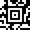

Code example:
```python
import pyzint

symbol = pyzint.Zint(
    '123456789', pyzint.BARCODE_HIBC_AZTEC
)

with open('HIBC_AZTEC.bmp', "wb") as bmp:
    bmp.write(symbol.render_bmp())
```
## DOTCODE

Example `DOTCODE` barcode with content `1234567890`


Code example:
```python
import pyzint

symbol = pyzint.Zint(
    '1234567890', pyzint.BARCODE_DOTCODE
)

with open('DOTCODE.bmp', "wb") as bmp:
    bmp.write(symbol.render_bmp())
```
## HANXIN

Example `HANXIN` barcode with content `1234567890`


Code example:
```python
import pyzint

symbol = pyzint.Zint(
    '1234567890', pyzint.BARCODE_HANXIN
)

with open('HANXIN.bmp', "wb") as bmp:
    bmp.write(symbol.render_bmp())
```
## MAILMARK

Example `MAILMARK` barcode with content `41038422416563762EF61AH8T`


Code example:
```python
import pyzint

symbol = pyzint.Zint(
    '41038422416563762EF61AH8T', pyzint.BARCODE_MAILMARK
)

with open('MAILMARK.bmp', "wb") as bmp:
    bmp.write(symbol.render_bmp())
```
## AZRUNE

Example `AZRUNE` barcode with content `1`


Code example:
```python
import pyzint

symbol = pyzint.Zint(
    '1', pyzint.BARCODE_AZRUNE
)

with open('AZRUNE.bmp', "wb") as bmp:
    bmp.write(symbol.render_bmp())
```
## CODE32

Example `CODE32` barcode with content `32`

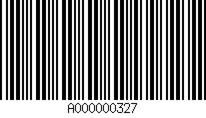

Code example:
```python
import pyzint

symbol = pyzint.Zint(
    '32', pyzint.BARCODE_CODE32
)

with open('CODE32.bmp', "wb") as bmp:
    bmp.write(symbol.render_bmp())
```
## EANX_CC

Example `EANX_CC` barcode with content `[21]A12345678` and primary `12345678+123`

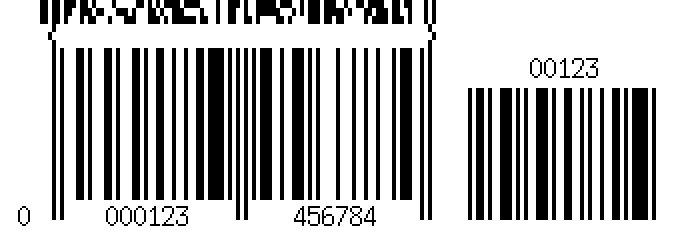

Code example:
```python
import pyzint

symbol = pyzint.Zint(
    '[21]A12345678', pyzint.BARCODE_EANX_CC, primary='12345678+123'
)

with open('EANX_CC.bmp', "wb") as bmp:
    bmp.write(symbol.render_bmp())
```
## RSS14_CC

Example `RSS14_CC` barcode with content `[21]A12345678` and primary `12345678`

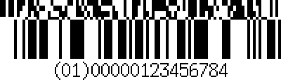

Code example:
```python
import pyzint

symbol = pyzint.Zint(
    '[21]A12345678', pyzint.BARCODE_RSS14_CC, primary='12345678'
)

with open('RSS14_CC.bmp', "wb") as bmp:
    bmp.write(symbol.render_bmp())
```
## RSS_LTD_CC

Example `RSS_LTD_CC` barcode with content `[21]A12345678` and primary `12345678`

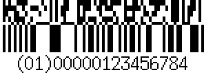

Code example:
```python
import pyzint

symbol = pyzint.Zint(
    '[21]A12345678', pyzint.BARCODE_RSS_LTD_CC, primary='12345678'
)

with open('RSS_LTD_CC.bmp', "wb") as bmp:
    bmp.write(symbol.render_bmp())
```
## UPCA_CC

Example `UPCA_CC` barcode with content `[21]A12345678` and primary `12345678`

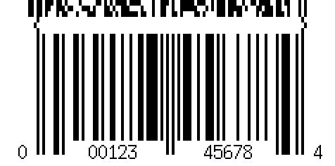

Code example:
```python
import pyzint

symbol = pyzint.Zint(
    '[21]A12345678', pyzint.BARCODE_UPCA_CC, primary='12345678'
)

with open('UPCA_CC.bmp', "wb") as bmp:
    bmp.write(symbol.render_bmp())
```
## UPCE_CC

Example `UPCE_CC` barcode with content `[21]A04252614` and primary `0425261`

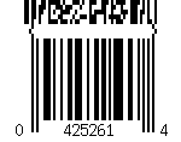

Code example:
```python
import pyzint

symbol = pyzint.Zint(
    '[21]A04252614', pyzint.BARCODE_UPCE_CC, primary='0425261'
)

with open('UPCE_CC.bmp', "wb") as bmp:
    bmp.write(symbol.render_bmp())
```
## RSS14STACK_CC

Example `RSS14STACK_CC` barcode with content `[21]A12345678` and primary `12345678`

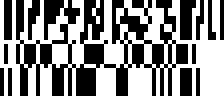

Code example:
```python
import pyzint

symbol = pyzint.Zint(
    '[21]A12345678', pyzint.BARCODE_RSS14STACK_CC, primary='12345678'
)

with open('RSS14STACK_CC.bmp', "wb") as bmp:
    bmp.write(symbol.render_bmp())
```
## RSS14_OMNI_CC

Example `RSS14_OMNI_CC` barcode with content `[21]A12345678` and primary `12345678`


Code example:
```python
import pyzint

symbol = pyzint.Zint(
    '[21]A12345678', pyzint.BARCODE_RSS14_OMNI_CC, primary='12345678'
)

with open('RSS14_OMNI_CC.bmp', "wb") as bmp:
    bmp.write(symbol.render_bmp())
```
## RSS_EXPSTACK_CC

Example `RSS_EXPSTACK_CC` barcode with content `[21]A12345678901234` and primary `[01]12345678901234`


Code example:
```python
import pyzint

symbol = pyzint.Zint(
    '[21]A12345678901234', pyzint.BARCODE_RSS_EXPSTACK_CC, primary='[01]12345678901234'
)

with open('RSS_EXPSTACK_CC.bmp', "wb") as bmp:
    bmp.write(symbol.render_bmp())
```
## CHANNEL

Example `CHANNEL` barcode with content `123`

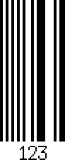

Code example:
```python
import pyzint

symbol = pyzint.Zint(
    '123', pyzint.BARCODE_CHANNEL
)

with open('CHANNEL.bmp', "wb") as bmp:
    bmp.write(symbol.render_bmp())
```
## CODEONE

Example `CODEONE` barcode with content `[21]A12345678` and primary `12345678`

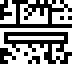

Code example:
```python
import pyzint

symbol = pyzint.Zint(
    '[21]A12345678', pyzint.BARCODE_CODEONE, primary='12345678'
)

with open('CODEONE.bmp', "wb") as bmp:
    bmp.write(symbol.render_bmp())
```
## GRIDMATRIX

Example `GRIDMATRIX` barcode with content `[21]A12345678` and primary `12345678`

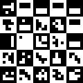

Code example:
```python
import pyzint

symbol = pyzint.Zint(
    '[21]A12345678', pyzint.BARCODE_GRIDMATRIX, primary='12345678'
)

with open('GRIDMATRIX.bmp', "wb") as bmp:
    bmp.write(symbol.render_bmp())
```
## UPNQR

Example `UPNQR` barcode with content `[21]A12345678` and primary `12345678`

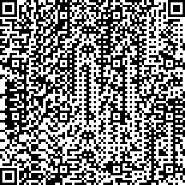

Code example:
```python
import pyzint

symbol = pyzint.Zint(
    '[21]A12345678', pyzint.BARCODE_UPNQR, primary='12345678'
)

with open('UPNQR.bmp', "wb") as bmp:
    bmp.write(symbol.render_bmp())
```
## RMQR

Example `RMQR` barcode with content `[21]A12345678` and primary `12345678`


Code example:
```python
import pyzint

symbol = pyzint.Zint(
    '[21]A12345678', pyzint.BARCODE_RMQR, primary='12345678'
)

with open('RMQR.bmp', "wb") as bmp:
    bmp.write(symbol.render_bmp())
```
